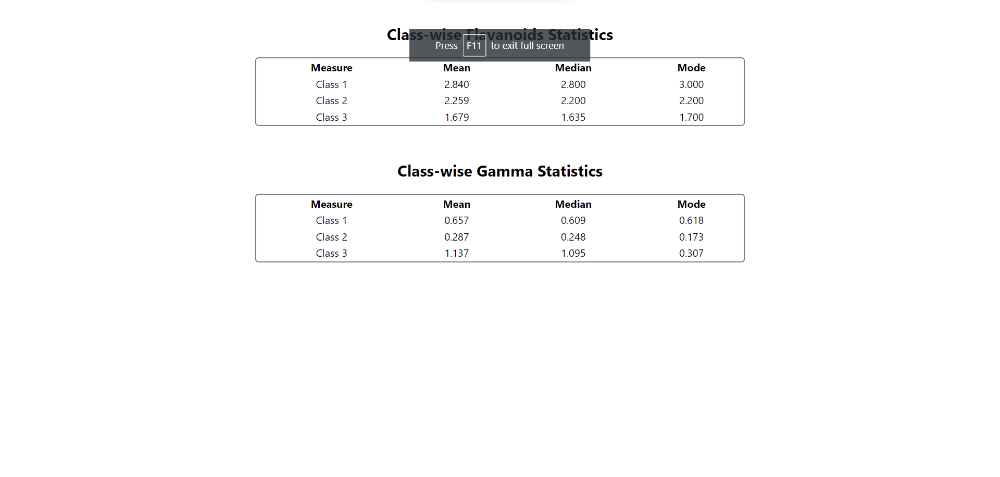

# Getting Started with Create React App
## Available Scripts

In the project directory, you can run:

How to start the application ?
### `yarn start`
Runs the app in the development mode.\
Open [http://localhost:3000](http://localhost:3000) to view it in the browser.

How to build the application ?
### `yarn run build`

The page will reload if you make edits.\
You will also see any lint errors in the console.

Please find the below image as the output of the code:
